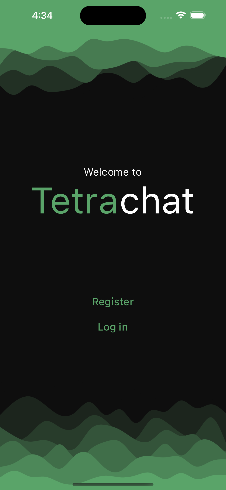
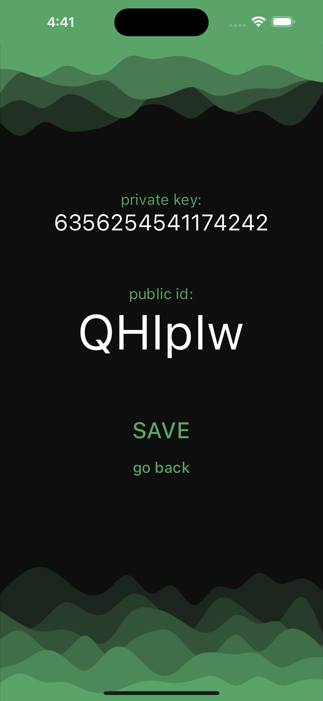
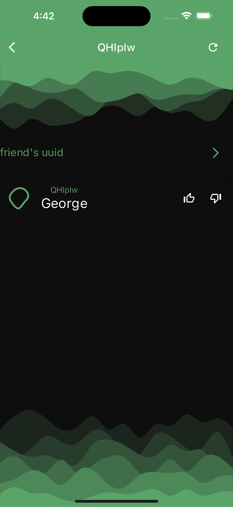
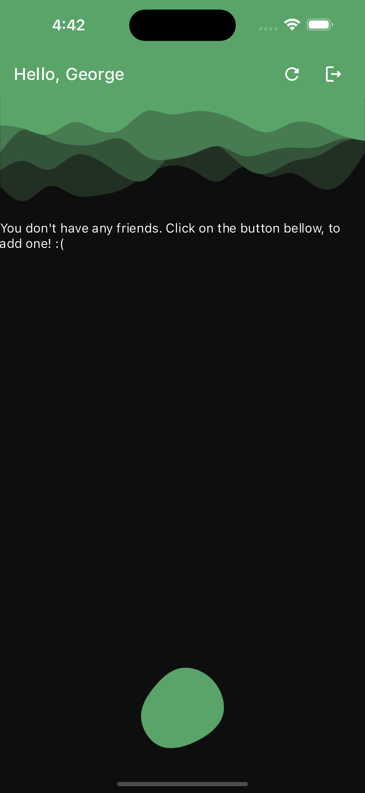

# TetraChat

### Work in progress
## Fun messaging app.

In this project i learned a lot about sockets, networking in general and what it takes to create a mobile app. This was my first time using dart.

